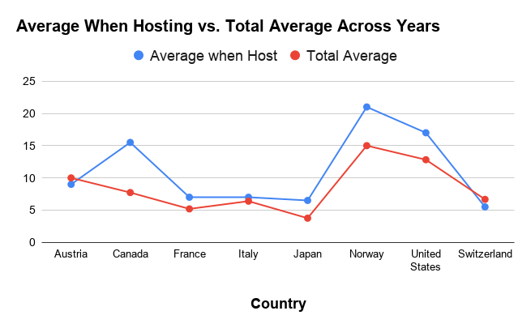

# Winter Olympics Data Analysis
  Analyzing the results of all the Winter Olympics

## Questions
  1. Is there a correlation between being from the host country and whether or not an athlete wins a medal? Does home advantage actually show up in the data?
  2. Are there any countries that are dominant in a specific sport? And are these the same countries that dominate overall, or do smaller nations punch above their weight in certain events?
  3. Has the global distribution of medals changed over time? Are traditional powerhouses still dominating, or are new countries emerging as competitors?

## Findings
  Yes, there is an advantage for athletes from the host country, and it is fairly clear. A few countries are very good at specific sports and win an outsized number of medals in that sport. One specific example is that The Netherlands has 
  won far more medals in speed skating than any other country, despite being a much smaller nation. Lastly, while the traditional powerhouses, such as Norway, continue to win many of the medals each year, there are many new countries who 
  have won medals. 

## Data Source
  [Kaggle - Olympic Games Dataset](https://www.kaggle.com/datasets/hassanjameelahmed/olympic-dataset)

